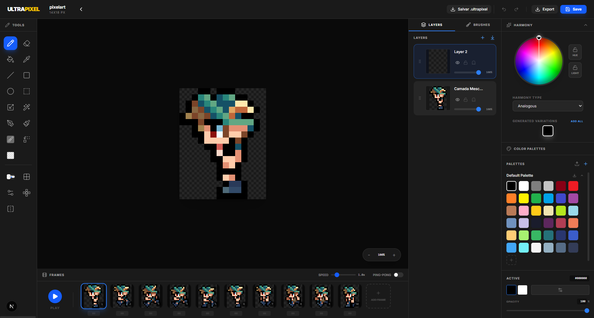

# 🎮 Anderson Nakanome — Jogos feitos por um jogador!

Seja bem-vindo à página oficial de **Anderson Nakanome**, fundador da Gold Skull Studios e desenvolvedor independente focado em experiências autênticas de sobrevivência e RPG.

Aqui você encontra informações sobre meus jogos e projetos em andamento.

---

## 🕹️ Sobre o jogo: Ultra Pixel Survive

**Ultra Pixel Survive** é uma fusão de RPG de ação e sobrevivência em pixel art. O jogo desafia você a dominar heróis únicos, coletar recursos e erguer defesas contra hordas noturnas em um mundo de fantasia implacável.

📢 Manifesto de Respeito: Versão 1.1.1.2
Atualmente, o jogo passa por uma transformação importante: a remoção completa de anúncios intrusivos. Acredito em um modelo de jogo limpo, onde o foco é a diversão e a integridade da experiência do jogador.

✨ O que define o jogo:
Sobrevivência Estratégica: Construa vilas, plante recursos e cozinhe para se manter vivo.

Defesa de Base: Posicione torres e armadilhas para resistir ao cerco inimigo.

Progressão Profunda: Desbloqueie heróis com mecânicas distintas e habilidades únicas de combate.

Exploração: Masmorras perigosas e chefes épicos em um estilo visual nostálgico e refinado.

### ✨ Principais recursos:

- 🏠 Construção e evolução de base  
- 🛡️ Defesa da vila com torres e armadilhas  
- 🌾 Agricultura, caça e culinária  
- 🔓 Sistema de progressão com heróis únicos  
- 🐲 Batalhas contra chefes em um mundo de fantasia épica  
- 🧩 Estilo visual em pixel art nostálgico  

Se você curte jogos indie com desafio e personalidade, **Ultra Pixel Survive** é feito pra você.

#### 🎨 Outros Projetos & Ferramentas
🖌️ Ultra Pixel (Em desenvolvimento)
Meu próprio editor de pixel art profissional, construído para oferecer a precisão que desenvolvedores solo precisam. Projetado para unir um workflow ágil com ferramentas técnicas poderosas de edição.

